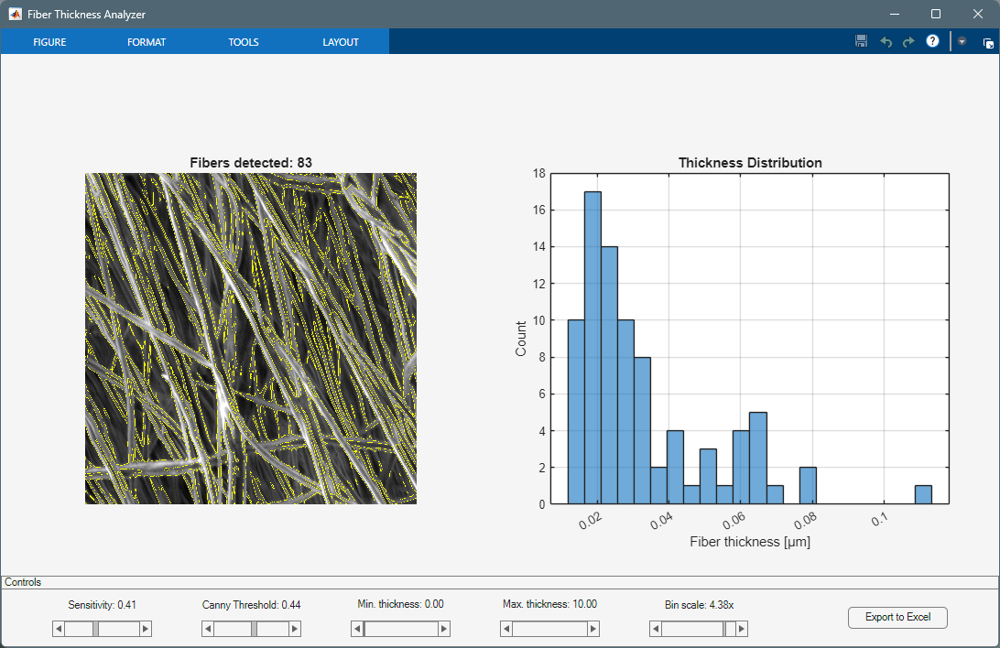

# Fiber Thickness Analyzer

Automatic detection of nanofibers from images and their statistical analysis using histograms.

## 📌 Usage
Run the script from the **Editor** tab or enter its filename in the **Command Window**.  
MATLAB's current folder must contain this script file.

## ⚙️ Requirements
- **Minimum MATLAB version:** R2018b  
- **Required toolbox:** [Image Processing Toolbox](https://www.mathworks.com/products/image.html)  
- **Recommended toolbox:** [Statistics and Machine Learning Toolbox](https://www.mathworks.com/products/statistics.html) *(for extensions)*

## 🤝 Acknowledgements
The research script is provided withing the project for MC application named *Polymer Composite Materials for Smart Catalys* wich refres for *COST Action CA22123 – European Materials Acceleration Center for Energy (EU-MACE)*, and by the Internal Grant Agency of Brno University of Technology, grant No. FEKT-S-23-8228.
 

